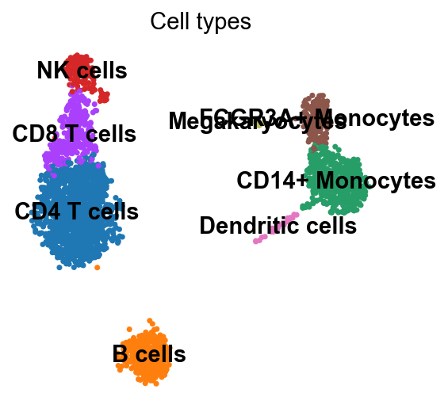
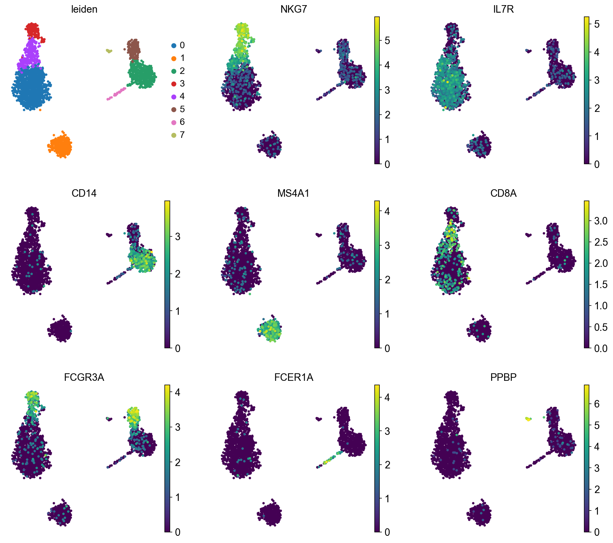
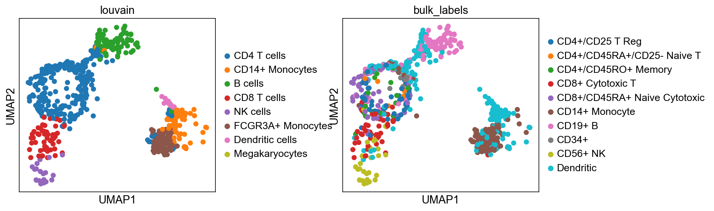
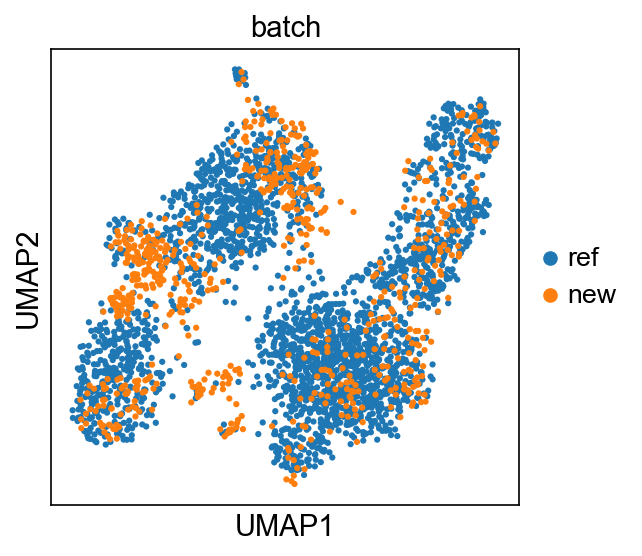

# Single-cell RNA-seq: PBMC clustering & data integration

Single-cell RNA-seq analysis of peripheral blood mononuclear cells (PBMCs) with
[Scanpy](https://scanpy.readthedocs.io/). The script reproduces two standard workflows:

1. **Clustering** of the 3k-PBMC dataset (QC → normalization → HVGs → PCA → Leiden) and
   annotation of the clusters with canonical marker genes.
2. **Reference-based label transfer** that maps a query dataset (`pbmc68k_reduced`) onto a
   labelled reference (`pbmc3k_processed`) using two integration methods — `sc.tl.ingest`
   and **BBKNN**.

<p align="center">
  
</p>

## Requirements

- Python ≥ 3.9 (tested on 3.11)
- Packages:

```bash
pip install "scanpy[leiden]" leidenalg igraph bbknn scikit-misc
```

> On Windows, `annoy` (a BBKNN dependency) has no prebuilt wheel and needs a C++ compiler.
> The easiest route is a conda environment: `conda install -c conda-forge python-annoy`,
> then `pip install bbknn --no-deps`.

## Usage

```bash
python main.py
```

This prints every cell-type count to the console and saves the UMAP figures to `./figures/`.
All datasets are downloaded automatically by Scanpy on first run.

## What the script does

### Problem 1 — Clustering 3k PBMCs
Loads `sc.datasets.pbmc3k()`, filters cells/genes, removes low-quality and high-mitochondrial
cells (→ **2638 cells**), normalizes (1e4 + log1p), selects 2000 highly-variable genes
(`seurat_v3`), regresses out total counts + %mito, scales, runs PCA → neighbors → UMAP, and
clusters with Leiden (`resolution=0.7`) → **8 clusters**. Clusters are labelled by marker genes
(IL7R, MS4A1, CD14, NKG7, CD8A, FCGR3A, FCER1A, PPBP).

**(a)** UMAP colored by Leiden cluster and by each marker gene:



**(b)** Clusters relabeled by cell type, and the cell counts per type:


| Cell type | # cells |
|---|--:|
| CD4 T cells | 1187 |
| CD14+ Monocytes | 475 |
| B cells | 343 |
| CD8 T cells | 274 |
| FCGR3A+ Monocytes | 163 |
| NK cells | 153 |
| Dendritic cells | 30 |
| Megakaryocytes | 13 |
| **Total** | **2638** |

### Problem 2 — Data integration (query = `pbmc68k_reduced`, 700 cells)

**(a)** `sc.tl.ingest` maps the query onto the reference and transfers the `louvain` labels by
k-NN in the reference PCA space. Left: transferred labels; right: the query's own `bulk_labels`.



**(b)** BBKNN builds a batch-balanced graph over the concatenated reference + query; cell types
are then transferred to the query by a connectivity-weighted majority vote among each query
cell's reference neighbors. The two batches overlap across all clusters after integration:



| Cell type | ingest (a) | BBKNN (b) |
|---|--:|--:|
| CD4 T cells | 291 | 191 |
| CD14+ Monocytes | 105 | 104 |
| B cells | 95 | 142 |
| CD8 T cells | 56 | 67 |
| NK cells | 22 | 34 |
| FCGR3A+ Monocytes | 116 | 116 |
| Dendritic cells | 15 | 44 |
| Megakaryocytes | 0 | 2 |
| **Total** | **700** | **700** |

> `ingest` is deterministic. BBKNN uses `annoy`'s approximate nearest neighbors, so its
> per-type counts can vary by a few cells between runs.

## References

- Clustering tutorial: <https://scanpy.scverse.org/en/stable/tutorials/basics/clustering-2017.html>
- Integration tutorial: <https://scanpy.readthedocs.io/en/1.10.x/tutorials/basics/integrating-data-using-ingest.html>
